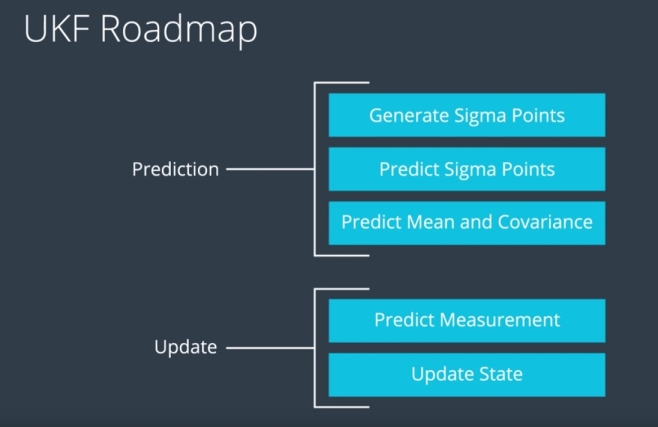

# Sensor Fusion using Unscented Kalman Filter

The main goal of the project is to apply Unscented Kalman Filter to fuse data from LiDAR and Radar sensors mounted on a self-driving vehicle (noisy environment). The pipeline is implemented using C++. 

For more details, please, check out the [source code directory](https://github.com/wafarag/UKF-Sensor-Fusion/tree/master/src) and the [testing data file](https://github.com/wafarag/UKF-Sensor-Fusion/blob/master/data/obj_pose-laser-radar-synthetic-input.txt). 

## Content of this repo
- `scr` a directory with the project code:
  - `main.cpp` - reads in data, calls a function to run the Kalman filter, calls a function to calculate RMSE
  - `ukf.cpp` - implements everything in the filter: initializes it, defines and calls the predict function for both lidar and radar, defines and calls the update function for both lidar and radar
  - `tools.cpp` - a function to calculate RMSE
- `data`  a directory with the input and output data files and records of the results
- `build`  a directory with object and executable files

## Result

The results of the EKF fusion algorithm for:
* [Both LiDAR and RADAR](https://github.com/wafarag/UKF-Sensor-Fusion/blob/master/data/Accuracy_Result_Both.txt): RMS => [0.064759, 0.080944, 0.145182, 0.15924].
* For [LiDAR alone](https://github.com/wafarag/UKF-Sensor-Fusion/blob/master/data/Accuracy_Result_Lidar.txt): RMS => [0.161211, 0.146364, 0.208204, 0.212872]. 
* For [RADAR alone](https://github.com/wafarag/UKF-Sensor-Fusion/blob/master/data/Accuracy_Result_Radar.txt): RMS => [0.20313, 0.253866, 0.304843, 0.22708].
